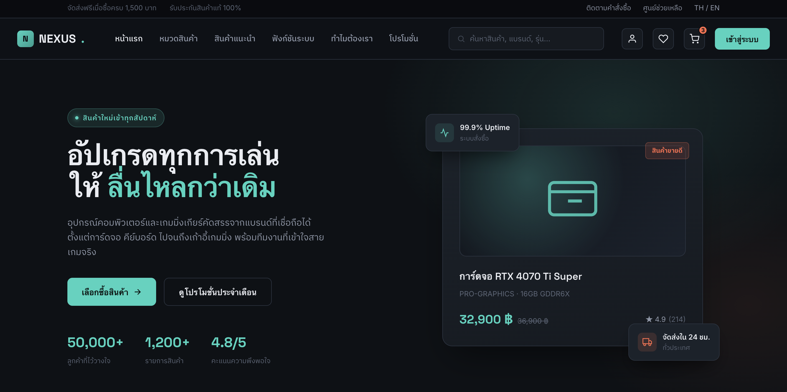

# Analysis & Design

## ชื่อโครงงาน
ระบบร้านค้าออนไลน์ขายอุปกรณ์คอมพิวเตอร์

---

## วัตถุประสงค์

- เพื่อพัฒนาระบบร้านค้าออนไลน์
- เพื่อให้ลูกค้าค้นหาและสั่งซื้อสินค้าได้สะดวก
- เพื่อให้ผู้ดูแลสามารถจัดการสินค้าและคำสั่งซื้อได้

---

## ผู้ใช้งาน

- ลูกค้า (Customer)
- ผู้ดูแลระบบ (Administrator)

---

## ฟังก์ชันหลัก

### ฝั่งลูกค้า
- สมัครสมาชิก
- เข้าสู่ระบบ
- ค้นหาสินค้า
- ดูรายละเอียดสินค้า
- เพิ่มลงตะกร้า
- ชำระเงิน
- ติดตามคำสั่งซื้อ

### ฝั่งผู้ดูแลระบบ
- จัดการสินค้า
- จัดการคำสั่งซื้อ
- ดูรายงานยอดขาย

---

## การออกแบบหน้าจอ (UI Design)

### หน้าแรก (Home Page)

หน้านี้เป็น Mockup ที่พัฒนาด้วย HTML และ CSS แสดง Banner, หมวดหมู่สินค้า, สินค้าแนะนำ และส่วนท้ายของเว็บไซต์